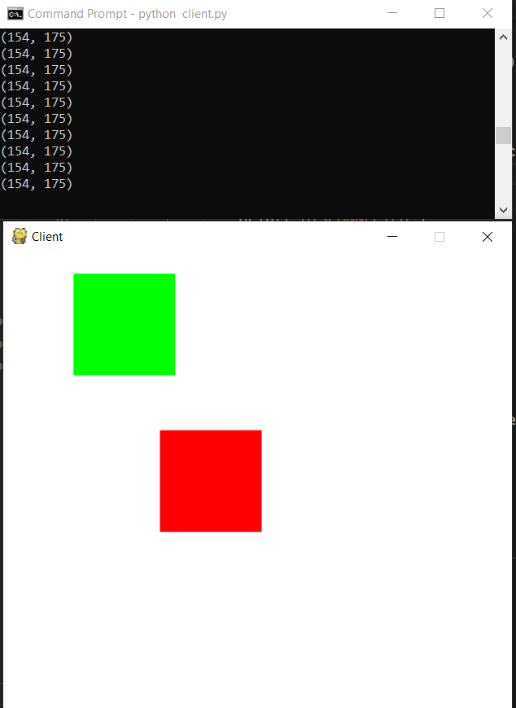
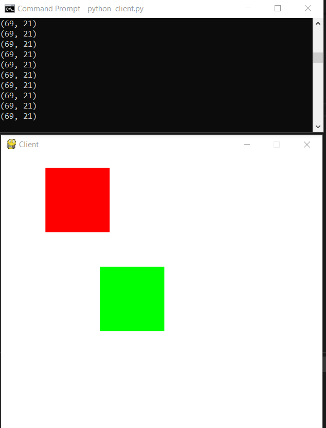
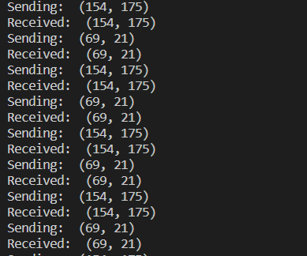

# Local-Server-Setup
## Setting up local server using sockets in python and playing a mini game 

## 1. Run ipconfig to get your local IPv4 address and change that in server.py file.
 

## 2. Run the server file.

 

## 3. Run the client.py file on a seperate terminal or device.

 

## 4.Run client.py file again on a seperate terminal and it should look like this.

 

## 5. The server should be sending and receiving constantly.

 

### *Note: only two cliets can connect together. Our player is Green and enemy is Red*
